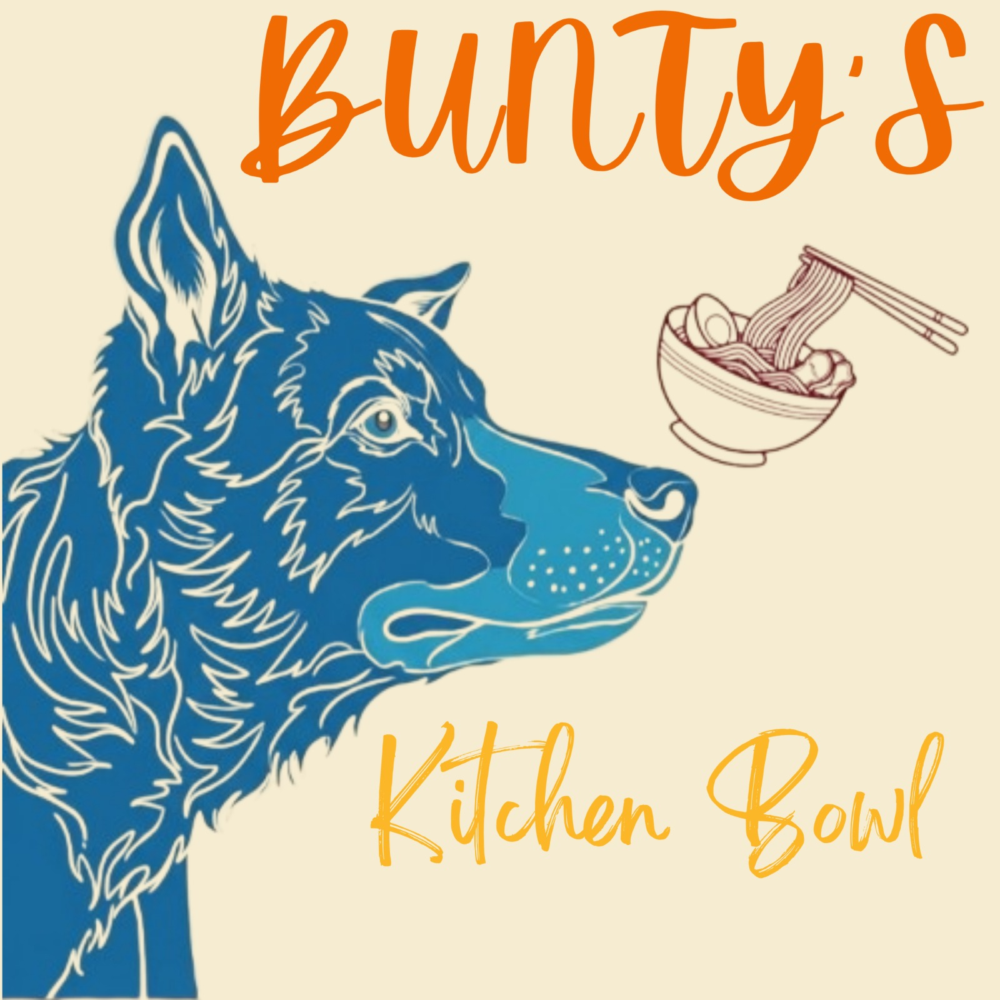
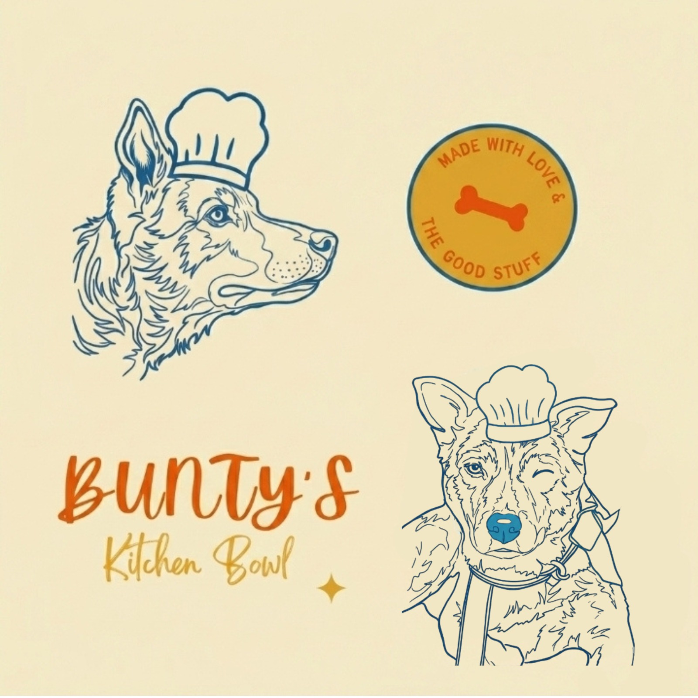
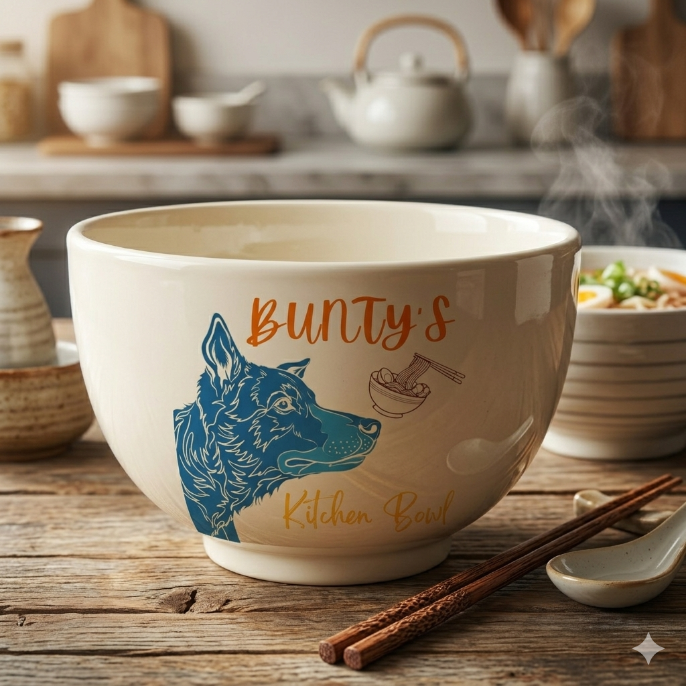
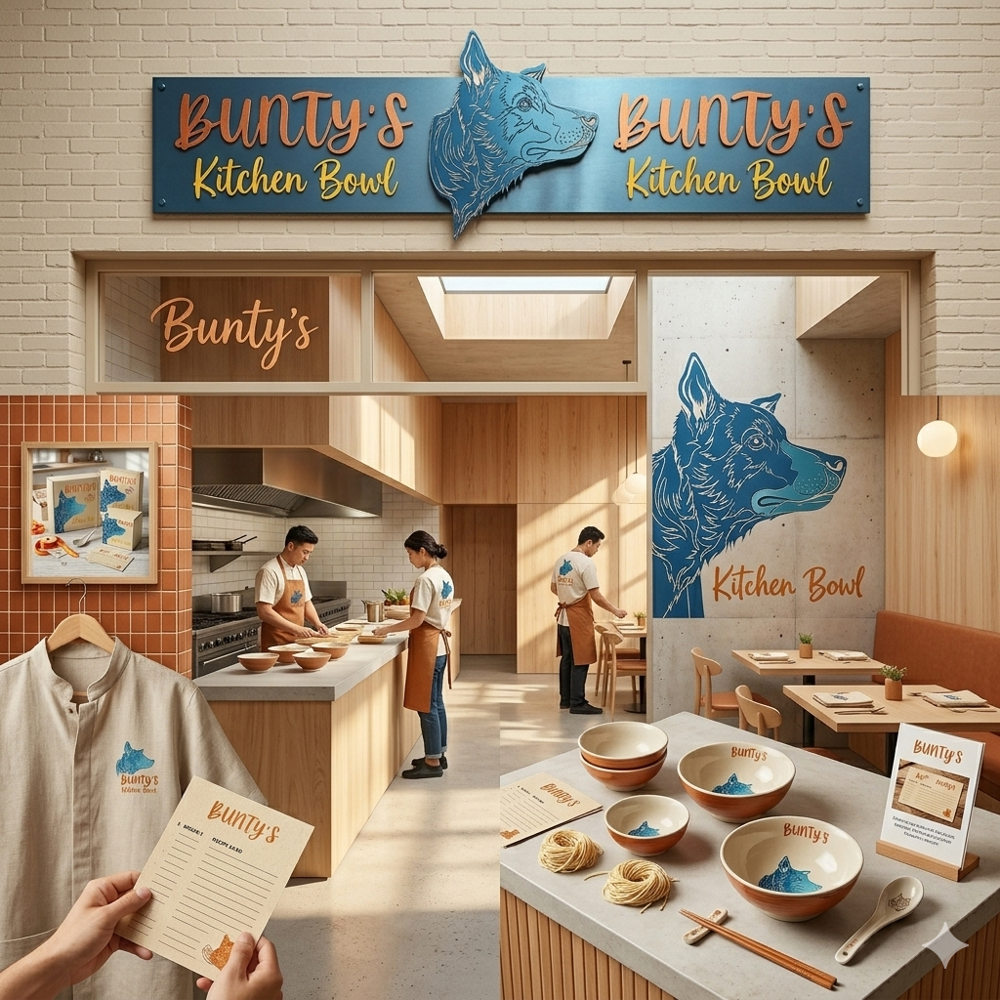
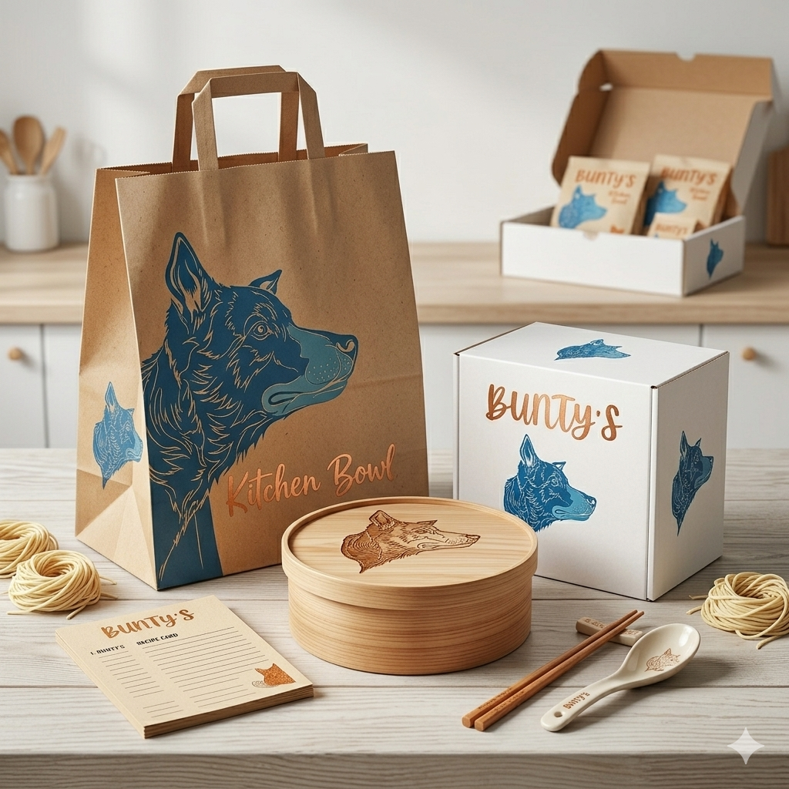

# Bunty's Kitchen Bowl – Brand Identity

## Overview

Bunty's Kitchen Bowl is a fictional pet food brand created as a personal branding project. The objective was to design a warm, friendly, and memorable brand identity that reflects trust, quality, and care for pets.

## Project Goals

- Design a unique brand identity
- Create a memorable logo concept
- Develop a consistent color palette and typography
- Visualize the brand through realistic mockups

## Design Elements

- Logo Design
- Typography
- Color Palette
- Packaging Design
- Bowl Mockup
- Shopping Bag Mockup
- Storefront Branding

## Tools Used

- Inkscape
- Photopea
- AI-generated mockups for presentation

## Skills Demonstrated

- Brand Identity Design
- Logo Design
- Typography
- Color Theory
- Layout & Composition
- Mockup Presentation
- Visual Storytelling

## Preview

 
 

## Note

This is a personal concept project created for learning and portfolio purposes.
